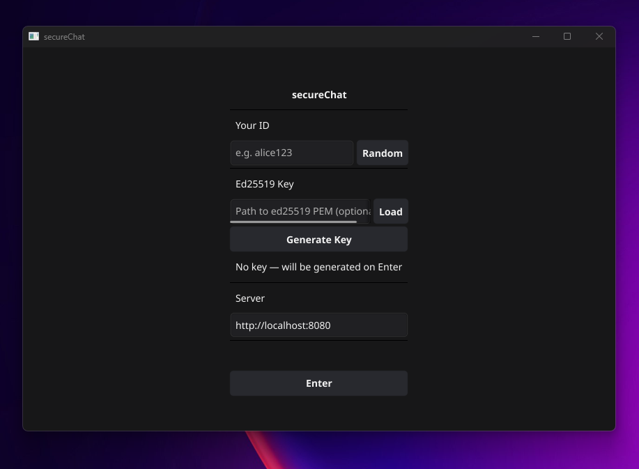
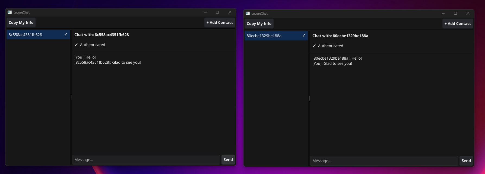

# secureChat
<div align="center">


</div>

---

Минималистичный мессенеджер, который сохранит вашу переписку в тайне. Позволяет общаться двум людям между собой, при этом, никоим образом не позволяя третьей стороне узнать содержимое диалога.

<div align="center">
  <table>
    <tr>
      <td></td>
      <td></td>
    </tr>
  </table>
</div>

---

## Содержание

- [secureChat](#securechat)
	- [Содержание](#содержание)
	- [Обзор](#обзор)
		- [Возможности](#возможности)
		- [Ограничения](#ограничения)
	- [Установка и запуск](#установка-и-запуск)
		- [Зависимости](#зависимости)
		- [Установка](#установка)
		- [Деплой](#деплой)
		- [Конфигурация клиента](#конфигурация-клиента)
	- [Алгоритм](#алгоритм)
		- [Handshake](#handshake)
		- [Деривация ключей](#деривация-ключей)
		- [Шифрование сообщений](#шифрование-сообщений)
	- [Пример использования алгоримта](#пример-использования-алгоримта)

## Обзор

### Возможности

- End-to-end шифрование — сервер является слепым ретранслятором. Он никогда не видит содержимое сообщений в открытом виде.
- ECDH (X25519) — эфемерный обмен ключами. Каждая сессия использует новую пару ключей.
- AES-256-GCM — аутентифицированное шифрование с дополнительными данными (AEAD). Обеспечивает конфиденциальность и целостность.
- HKDF-SHA256 — детерминированная деривация раздельных ключей для каждого направления передачи (write и read).
- Ed25519 подписи (опционально) — верификация подлинности собеседника при handshake, исключающая MITM даже при компрометации сервера.
- XOR-соль — каждая сторона вносит 32 байта случайной соли; финальная соль вычисляется через XOR, исключая возможность управления ею одной стороной.
- GUI на Fyne — кроссплатформенный нативный интерфейс (Linux, macOS, Windows).
- Простой relay-сервер — не хранит сообщения на диске, работает через HTTP + WebSocket, без авторизации.

### Ограничения

- MITM без ed25519: если вы не обменялись ключами по защищённому каналу и не указали trustedKey при добавлении контакта — сервер или посредник может подменить DH-ключи. Клиент предупредит об этом ("⚠ NOT authenticated").
Endpoint security: если устройство пользователя скомпрометировано — переписка может быть прочитана прямо из памяти/UI.
- Метаданные: сервер знает, когда и между какими ID происходит обмен (но не содержимое).
- Анонимность: ID выбирается пользователем, привязки к личности нет, но IP-адреса логируются сервером.
- Отсутствие PFS в пределах сессии: ключи эфемерны (новые на каждый вызов ContactWith), но в рамках одной сессии не ротируются.
- Нет хранения сообщений: сервер не хранит историю. При разрыве соединения непрочитанные сообщения могут быть потеряны (буфер 64 сообщения).
- Нет групповых чатов: только 1:1 соединения.

---

## Установка и запуск

### Зависимости

- Go 1.24+
- just (опционально, task runner)
- Docker + Docker Compose (для запуска сервера в контейнере)

Зависимости для сборки Fyne (GUI):
- Linux: gcc, libgl1-mesa-dev, xorg-dev
- macOS: Xcode Command Line Tools
- Windows (кросс-компиляция): mingw-w64

### Установка
```sh
# Клонировать репозиторий
git clone https://github.com/withoutforget/secureChat.git
cd secureChat

# Запустить сервер
# По умолчанию сервер работает на http://localhost:8080
just server
# или: go run cmd/server/main.go

# В другом терминале — сбилдить клиент
# пока клиент протестирован только на винде
just windows_client
```
p.s. Вместо `just` вы можете просто скопировать команду оттуда и вставить в терминал. Они достаточно короткие на данный момент.

### Деплой

Чтобы поднять на вашей машине сервер необходимо сделать следующее:
```sh
git clone https://github.com/withoutforget/secureChat.git
cd secureChat
export COMPOSE_FILE=./deploy/docker-compose.yaml
docker compose up -d
```

В `docker-compose.yaml` вы можете изменить, на какой порт будет пробрасываться ваш сервер.

### Конфигурация клиента

Сам клиент имеет конфиг. В данный момент этот конфиг создаётся автоматически при старте приложения.
Приложение пытается найти переменную окружения `VAR`. Если находит — использует её, чтобы взять как путь для конфига. Иначе он осоздаёт в данной директории файл `secure_chat.toml` и записывает туда данные.

На данный момент конфиг выглядит следующий образом
```toml
[server]
  server_url = "http://localhost:8080"
```

---

## Алгоритм

### Handshake

Handshake устойчив к сетевым гонкам:

1. **Фаза отправки** — Алиса отправляет `(salt ‖ pub ‖ sig)` и каждые 3 секунды повторяет отправку до получения ответа.
2. **Фаза ожидания** — Алиса ждёт `(salt ‖ pub ‖ sig)` от Боба (таймаут 30 секунд).
3. **Финальные досылки** — после завершения handshake Алиса ещё 3 раза с задержкой 500 мс досылает своё HS-сообщение, чтобы гарантировать его получение Бобом (защита от гонки «один завершил раньше»).

> Это исключает deadlock: даже если один из клиентов запустился позже, retry-логика гарантирует доставку.

---

### Деривация ключей

```
HKDF-SHA256(
    secret = X25519(myPrivKey, peerPubKey),   // 32 байта ECDH
    salt   = myServerSalt XOR peerServerSalt, // 32 байта
    info   = "a2b" | "b2a"
) → 32-байтный AES-256 ключ
```

Раздельные ключи по направлениям `a2b` и `b2a` исключают атаки с отражением сообщений _(reflection attack)_.

---

### Шифрование сообщений

```
Encrypt(plaintext):
    nonce = rand(12 байт)               // NonceSize() для AES-GCM
    ct    = AES-256-GCM.Seal(nonce, plaintext, nil)
    return nonce ‖ ct                   // первые 12 байт — nonce

Decrypt(payload):
    nonce, ct = payload[:12], payload[12:]
    return AES-256-GCM.Open(nonce, ct, nil)
```

GCM обеспечивает **аутентификацию** — любое изменение шифротекста вызовет ошибку расшифровки.

---

## Пример использования алгоримта

Ниже напсан код, который демонстрирует, как именно клиент работает с ключами. На самом деле, в реализации ещё учавствует ed25519, однако здесь его не будет, чтобы не было лишних деталей.

p.s. В примере нет ed25519, потому что, по сути, он работает независимо от этой схемы.
При самой передаче сообщения с солью и публчиным ключом надо его отправлять. В фактической реализации он присутствует.

```go
func main() {
	// Создаём клиента 1
	client1, err := message.NewSecretMessage()
	if err != nil {
		panic(err)
	}
	// Создаём клиента 2
	client2, err := message.NewSecretMessage()
	if err != nil {
		panic(err)
	}

	// обмениваемся солью и публичными ключами
	c1Salt, c2Salt := client1.GetSalt(), client2.GetSalt()
	key1, key2 := client1.GetPublicKey(), client2.GetPublicKey()
	
	// у каждого клиента устанавливаем общий ключ
	// также тут происходит генерация aes-gcm
	err = client1.SetUpSharedKey(key2, c2Salt)
	if err != nil {
		panic(err)
	}
	err = client2.SetUpSharedKey(key1, c1Salt)
	if err != nil {
		panic(err)
	}

	// шифрование сообщения
	enc, err := client1.GenerateMessage([]byte("Hello world from me!"))
	if err != nil {
		panic(err)
	}
	// расшифровка сообщения
	dec, err := client2.ReadMessage(enc)
	if err != nil {
		panic(err)
	}
	fmt.Println(string(dec))
}
```